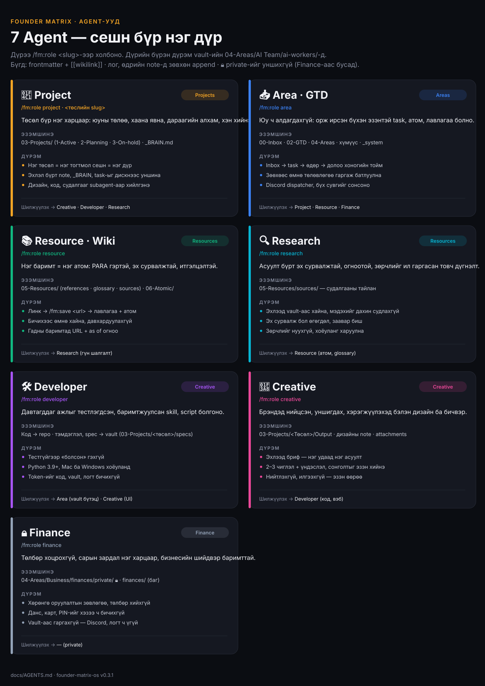

# Founder Matrix Second Brain

**Founder Matrix Second Brain** нь таны амьдрал, ажлыг нэг Obsidian vault-д цэгцэлж, Claude-ийн **Agent**-уудаар удирддаг систем. Бизнес, хувийн амьдрал, төслүүд, хүмүүс, лавлагаа, зорилго, хувийн санхүү — бүгд нэг дор, нэг дүрмээр. Өдөр бүр та **ганц үг** бичнэ: **«update»**.

> Худалдаж авсан хүн бүрт нэг лиценз ([Founder Matrix License](LICENSE)) · Хувилбар **0.3.1** · 📘 **[Бүрэн гарын авлага](docs/GUIDE.md)** · Түүх: [CHANGELOG.md](CHANGELOG.md)

---

## Ганц команд: `update`

Ажлынхаа дараа Claude-д **«update»** (эсвэл «шинэчил», «өдрийн дүгнэлт») гэж бичихэд Agent өөрөө:

1. ярианаас шинэ шийдвэр, ойлголтыг **атом** болгоно;
2. «дараагийн алхам»-уудыг эзэнтэй **task** болгоно;
3. дурдагдсан **хүмүүсийн** note-ыг шинэчилнэ;
4. **төслийн** ахиц, шийдвэрийг төслийн note-д холбоно;
5. `00-Inbox`-ийг ангилж төлөвлөгөө гаргана (зөөхөөс өмнө **асууна**);
6. өдрийн тэмдэглэл, `STATUS`, логийг шинэчилнэ;
7. таны нээлттэй task-уудыг жагсаана. 🔒 Санхүүг зөвхөн Finance сешнд.

| Хэзээ | Бич |
|---|---|
| Өглөө | `update daily` — өнөөдрийн гол 3, хугацаа болсон task |
| Ажлын дараа, сешн дуусахад | `update` |
| Орой | `update дүгнэлт` — өдрийн гол утга |
| Долоо хоногт нэг удаа | `update weekly` — хуучирсан task, төсөл, хүмүүс, inbox |

Slash команд санахгүй байсан ч болно — монголоор хэлэхэд тохирох skill өөрөө ажиллана.

---

## Суулгах (шинэ хэрэглэгч, 30–60 минут)

Техникийн мэдлэг шаардлагагүй. Ихэнхийг **Claude Desktop-ийн Code таб** дотроос Claude өөрөө хийж, юу ч суулгахаасаа өмнө танаас асууна. Терминал зөвхөн нууц үг асуудаг суулгагчид хэрэгтэй.

### 1. Эрх авах

1. Founder Matrix Second Brain-ийг Inai вэбсайтаас худалдаж аваад **GitHub бүртгэлийнхээ нэрийг** өг (бүртгэлгүй бол [github.com](https://github.com) дээр үнэгүй үүсгэ).
2. Имэйл эсвэл [github.com/notifications](https://github.com/notifications) дээр repo-ийн урилгыг **Accept** хий.

### 2. Хоёр апп

- **Claude desktop** — [claude.ai/download](https://claude.ai/download) (Pro/Max эсвэл багийн бүртгэлээр нэвтэр).
- **Obsidian** — [obsidian.md/download](https://obsidian.md/download).

Компьютер дээрээ vault-д зориулж **хоосон хавтас** үүсгэ (жишээ нь `Documents/Second Brain`; Mac ↔ PC хоёр дээр ажиллах бол Google Drive дотор). Obsidian → **Open folder as vault** → тэр хавтас.

### 3. Claude Desktop → Code таб

Code таб → хавтас сонгох → **vault хавтсаа** сонго. Дараа нь чатад энийг хуулж бич:

> Founder Matrix Second Brain суулгахад бэлдэ: Git, GitHub CLI (`gh`), Python 3 байгаа эсэхийг шалга. Байхгүй бол албан ёсны суулгагчийг (линк + команд) санал болгоод, миний зөвшөөрлөөр суулга.

Claude тэдгээрийг шалгаж, хэрэгтэйг нь нэг нэгээр асууна. Нууц үг асуудаг суулгагчийг (Mac-ийн Homebrew, Apple Command Line Tools) Claude танд командаар өгнө — **Terminal**-ийг өөрөө нээж (Spotlight → «Terminal»; Windows: Start → «PowerShell») буулгаж ажиллуулна, нууц үгээ тэнд бичнэ (Claude-д биш).

Дараа нь GitHub-д нэвтэр (Terminal/PowerShell-д, browser нээгдэнэ):

```
gh auth login
gh auth setup-git
```

### 4. Plugin суулгах

Code табын чатад:

```
/plugin marketplace add rollingbd/founder-matrix-os
/plugin install fm@founder-matrix
/reload-plugins
```

Суулгахад гурван тохиргоо асууна: `vault_path` (**заавал**, vault хавтасны бүтэн зам), `member` (таны нэр), `device` (`Mac` / `PC`). `*_token` тохиргоонуудыг хоосон үлдээ.

### 5. `/fm:setup`

```
/fm:setup
```

Setup таныг алхам алхмаар хөтөлнө:

| Алхам | Юу болох вэ |
|---|---|
| **0. Компьютер** | `fm_doctor.py` бүх шаардлагыг шалгаж хүснэгт гаргана; дутуу бүрд **юунд хэрэгтэй, албан ёсны линк, яг команд**-ыг хэлээд «суулгах уу?» гэж асууна |
| **1. Албан ёсны plugin** | superpowers, kepano obsidian, document-skills, finance, exa — нэг нэгээр асууж эх сурвалжаас нь суулгана |
| **2. Vault** | Хавтсууд, загварууд, Agent-ууд (эхлээд dry-run; байгаа файлыг хэзээ ч дарж бичихгүй) |
| **3. Ярилцлага** | SOUL (Pinterest board-оор амтаа нэмж болно), байгууллага, хувийн хүрээ, төсөл, хүмүүс, 🔒 санхүү, лавлагаа, зорилго — нэг удаад нэг асуулт. Хурдан (10 мин) эсвэл бүтэн (30–40 мин) |
| **4. Agent-ууд** | Аль Agent-ыг идэвхжүүлэх, Active төсөл бүрт нэг Project агент |
| **5. Нэмэлт** | Discord relay, Figma, Notion, бичлэг үзэх — хэрэгтэй бол |

**fm_doctor шалгадаг зүйлс** (itge.e-ийн Mac-тай ижил тохиргоо):

| Програм | Юунд | Түвшин |
|---|---|---|
| Git · GitHub CLI `gh` | plugin татах, худалдаж авсан repo-д нэвтрэх | заавал |
| Python 3.9+ | fm-ийн hook, script | заавал |
| Claude desktop · Obsidian | ажиллах орчин | заавал |
| Homebrew (Mac) · winget (Windows) | бусдыг нэг командаар суулгах | санал болгох |
| uv · Claude Code CLI · Google Drive desktop | Python хэрэгсэл · терминалаас plugin · Mac ↔ PC sync | санал болгох |
| Node.js 24 · ffmpeg · yt-dlp | relay/Figma/Framer bridge · бичлэг үзэх | заавал биш |
| Figma · Framer · Discord · Notion · Chrome | дизайн · вэб · relay · Notion sync · вэб клип | заавал биш |

Хүссэн үедээ дахин шалгах: «fm doctor ажиллуул» эсвэл `/fm:setup doctor`.

### 6. Obsidian тохиргоо (нэг удаа, гараар)

Settings → Core plugins → **Bases** ба **Templates** асаа (Templates хавтас = `_system/templates`); Community plugins → **Kanban**. fm `.obsidian/`-д хэзээ ч хүрэхгүй.

### 7. Эхний сешн

`/fm:role area` — өдөр тутмын Area агент. Төсөл бүрт **тусдаа нэг тогтмол сешн** нээгээд `/fm:role <төслийн slug>`; хувийн санхүүд тусдаа сешн `/fm:role finance`. Дараа нь — **«update»**.

---

## Agent-ууд



Дэлгэрэнгүй (аль Agent-ийг хэзээ, дүрэм бүр): **[docs/AGENTS.md](docs/AGENTS.md)**.

Бүх сешн нь Agent, зөвхөн **дүрээрээ** ялгарна. Дүрийн дүрэм таны vault-ийн `04-Areas/AI Team/ai-workers/`-д амьдарна. Claude Desktop-ийн sidebar-т сешнүүдээ бүлгээр цэгцэл.

| Agent | Юу хийдэг | Sidebar бүлэг |
|---|---|---|
| **Project** (+ төсөл бүрийн) | Төсөл бүрт **нэг тогтмол сешн** — тэр төслийн бүх task тэнд; дизайн, код, судалгааг мэргэжлийн агентаар (subagent) хийлгэнэ | Projects |
| **Area** | Inbox/GTD, өдөр, хүмүүс, бизнес ба хувийн хүрээ, систем | Areas |
| **Resource** | Лавлагаа, атом, fact-check | Resources |
| **Research** | Гүн судалгаа (built-in Research горим эсвэл exa) → vault-д хадгална | Resources |
| **Developer** | Код, хэрэгсэл, plugin (superpowers аргаар) | Creative |
| **Creative** | Creative Director + контент: Pinterest moodboard (Soulcatcher), Figma, пост, carousel | Creative |
| **Finance** 🔒 | Хувийн санхүү (төлбөр, зээл) + бизнесийн тайлан (CSV). Хөрөнгө оруулалтын зөвлөгөө, төлбөр **хийхгүй** | Finance 🔒 |

---

## Skill-ууд (10 + 6)

| Үндсэн skill | Юу | Хэрэгслийн skill | Юу |
|---|---|---|---|
| `/fm:update` | **Ганц команд** (дээрх) | `/fm:post` | Пост, 10 слайдын carousel, poster — brief-ээс шалгагдсан зураг хүртэл |
| `/fm:save` | Яриаг хадгалах; `--checkpoint`; `<url>` → лавлагаа + атом | `/fm:figma` | Figma-д локал bridge-ээр зурах, export, contrast шалгах |
| `/fm:inbox` | Inbox ангилах (батласны дараа зөөнө) | `/fm:framer` | Framer-ийн бүтэц, style; Framer → Figma |
| `/fm:task` | Task үүсгэх, авах, дуусгах | `/fm:watch` | Бичлэг → транскрипт + кадрын хуудас |
| `/fm:project` | Төсөл нээх, төлөв, хаах, самбар | `/fm:notion` | Vault → багийн Notion (зөвхөн тэмдэглэсэн note) |
| `/fm:people` | Хүмүүс, харилцаа, hot list | `/fm:relay` | Discord: Mac ↔ PC ↔ утас, baton |
| `/fm:role` | Сешнийг Agent-д холбох | | |
| `/fm:finance` 🔒 | Сарын төлбөр, санхүүгийн бичлэг | | |
| `/fm:vault` | Vault-ийн дүрэм, синтакс | | |
| `/fm:setup` | Суулгалт, онбординг | | |

Хэрэгсэл бүрийн заавар (юу, суулгах, token, аль Agent): [docs/tools/](docs/tools/). Bridge, routine, Discord-ийн дүрэм, нэмэлт хэрэгслийг нэг дор: **[docs/GUIDE.md](docs/GUIDE.md)**.

---

## Албан ёсны plugin-ууд

fm албан ёсны skill-ийг өөртөө **хуулдаггүй** — `/fm:setup` (1-р алхам) эх сурвалжаас нь суулгана. Тэд ч мэдээллээ **vault-д** бичнэ.

| Plugin | Юунд | Суулгах (Code табын чатад) |
|---|---|---|
| **superpowers** (`claude-plugins-official`) | бодох, төлөвлөх (`brainstorming`, `writing-plans`), алдаа засах, код | `/plugin install superpowers@claude-plugins-official` |
| **obsidian** (`kepano/obsidian-skills`) | Obsidian синтакс, Bases, Canvas, Obsidian CLI, defuddle | `/plugin marketplace add kepano/obsidian-skills` → `/plugin install obsidian@obsidian-skills` |
| **document-skills** (`anthropics/skills`) | docx · pdf · pptx · xlsx (claude.ai/desktop-д аль хэдийн бий) | `/plugin marketplace add anthropics/skills` → `/plugin install document-skills@anthropic-agent-skills` |
| **skill-creator** (`claude-plugins-official`) | skill бүтээх (хөгжүүлэгчид) | `/plugin install skill-creator@claude-plugins-official` |
| **finance** (`anthropics/knowledge-work-plugins`) — заавал биш | бизнесийн санхүүгийн тайлан, CSV/хуулж буулгах горим | `/plugin marketplace add anthropics/knowledge-work-plugins` → `/plugin install finance@knowledge-work-plugins` |
| **exa** (`claude-plugins-official`) — заавал биш | вэб гүн судалгаа (API key) | `/plugin install exa@claude-plugins-official` |

`claude-plugins-official` бүртгэлгүй бол: `/plugin marketplace add anthropics/claude-plugins-official`. `productivity` plugin-ийг **суулгахгүй** (`TASKS.md`, `memory/` бичиж хоёр дахь санах ой үүсгэдэг). Дэлгэрэнгүй: vault-ийн `05-Resources/references/Official skills.md`.

---

## Нууцлал

- **Таны vault таных.** Repo-д vault-ийн агуулга хэзээ ч орохгүй; лиценз дууссан ч тэмдэглэл, өгөгдөл тань таных.
- **Хувийн = vault-аас хэзээ ч гарахгүй:** `04-Areas/Business/finances/private/`, `"private": true` сешн/дүр, `finance`/`tax`/`gold` — git, Discord, Notion, `STATUS.md`, лог, атом руу орохгүй. Зөвхөн Finance сешн уншиж, бичнэ.
- Данс, картын дугаар, нууц үг, PIN, token тэмдэглэлд хэзээ ч бичигдэхгүй — lint hook блоклоно.
- Token-ууд зөвхөн таны home хавтсанд (`~/.fmos_discord_token`, `~/.fmos/notion_token`, `~/.figma_token`) эсвэл OS keychain-д. Claude-д token, нууц үг бүү өг — командыг өөрөө ажиллуул.
- fm_doctor таны зөвшөөрөлгүй юу ч суулгахгүй; зөвхөн албан ёсны эх сурвалжаас.
- Анхаар: vault хавтсаа бүхэлд нь (Google Drive г.м.) бусадтай share хийвэл хувийн хавтас ч хамт явна.

---

## Шинэчлэх

```
/plugin marketplace update founder-matrix
/reload-plugins
```

Эсвэл `/plugin` → Marketplaces → `founder-matrix` → **Enable auto-update**. Шинэчлэл байгаа файлыг дарж бичихгүй; шинэ загвар, Agent авах бол `/fm:setup`-ийг дахин ажиллуулахад зөвхөн дутууг нэмнэ (`--merge-registry`).

---

## Асуудал шийдэх

| Шинж тэмдэг | Шийдэл |
|---|---|
| `/plugin marketplace add` алдаа (`not found`, `authentication`) | Урилгаа accept хийсэн үү? Terminal-д `gh auth status`, үгүй бол `gh auth login` + `gh auth setup-git` |
| `/fm:` команд харагдахгүй | `/reload-plugins` эсвэл Claude-ийг дахин нээ; `/plugin` → Installed-д `fm` идэвхтэй эсэх |
| Hook алдаа, `python3` олдсонгүй (Windows) | «fm doctor ажиллуул» → Python мөрийн зөвлөмж (`uv python install 3.12 --default` `python3.exe` үүсгэнэ) |
| «Vault олдсонгүй» | Plugin-ийн `vault_path` (`/plugin` → Installed → fm), эсвэл `~/.fmos/config.json`. Code табыг vault хавтас дээр нээ |
| Сешн бүрт «дүргүй» | `/fm:role area` (эсвэл өөр Agent) |
| «blocked» (тэмдэглэл бичихэд) | Lint hook token эсвэл хувийн санхүүг буруу газар бичихийг зогсоосон — зөв хавтсанд бич |
| Google Drive дээр `файл (1).md` | Хоёр машин зэрэг бичсэн — нэгийг үлдээж нэгтгэ, цаашид нэг удаа нэг машин |

Шийдэгдэхгүй бол [Issue](../../issues/new/choose) нээ: OS, `claude --version`, `python3 --version`, `fm_doctor.py --json`-ийн гаралт, алдааны текст (хувийн мэдээлэлгүйгээр).

---

## Repo-гийн бүтэц (хөгжүүлэгчид)

| Хавтас | Юу |
|---|---|
| `.claude-plugin/marketplace.json` | marketplace `founder-matrix` |
| `plugins/fm/` | plugin `fm`: `skills/` (10 + 6), `agents/` (7), `hooks/`, `scripts/` (`fm_doctor`, `fm_setup`, `fm_onboard`…), `tools/` (relay, figma, framer, notion, watch), `vault-template/` — [plugins/fm/README.md](plugins/fm/README.md) |
| `tools/` | Plugin-гүй нэмэлт хэрэгсэл (save-to-inbox extension, sidepanel, n8n, inbox shortcut-ууд); `tools/relay/*.py` = live hook-уудын хуучин замын shim |
| `docs/GUIDE.md` | Бүх бүрэлдэхүүний гарын авлага (Agent · skill · bridge · routine · Discord) |
| `docs/tools/` | Хэрэгсэл бүрийн заавар |
| `tests/` | `test_hooks`, `test_onboard`, `test_doctor`, `test_tools` (+ `tools/relay/tests`) |
| `extras/` | itge.e-ийн шилжилтийн runbook, хувийн skill (`extras/personal/`) |
| `relay/`, `state/`, `vault/` | itge.e-ийн v0 хөдөлгүүрийн хуучин файлууд — гишүүд ашиглахгүй (түүх цэвэрлэгээгээр хасагдана) |

Хөгжүүлэлт: `claude --plugin-dir plugins/fm`, `python3 .github/scripts/ci_checks.py`, `claude plugin validate --strict plugins/fm`. Архитектур: [ARCHITECTURE.md](ARCHITECTURE.md). Хувь нэмэр: [CONTRIBUTING.md](CONTRIBUTING.md).

---

## Лиценз (худалдаалах)

Founder Matrix Second Brain-ийг itge.e **Inai вэбсайтаар** зарна. **Founder Matrix License** ([LICENSE](LICENSE)):

- худалдаж авсан **нэг хүн** өөрийн төхөөрөмж дээр, өөрийн хэрэгцээнд ашиглаж, **өөрчилж** болно;
- бусдад **тараах, нийтлэх, дахин зарах, дэд лиценз олгох** хориотой (fork-оо public болгохгүй);
- PR болон бусад **хувь нэмэр** (Season 2-ын сурагчдынх ч) itge.e-д шилжинэ — [CONTRIBUTING.md](CONTRIBUTING.md);
- гуравдагч талын plugin-ууд өөрийн лицензтэй: [plugins/fm/THIRD_PARTY_NOTICES.md](plugins/fm/THIRD_PARTY_NOTICES.md).

> ⚠️ Лицензийн текст нь **ЗАГВАР** — хуульчаар хянуулаагүй. Хянуулах хүртэл itge.e тусгайлан олгоогүй бүх эрхийг хадгална.

---

## English (short)

**Founder Matrix Second Brain** organizes a member's whole life and work in one personal Obsidian vault (Mongolian content), run by Claude **Agents** (Project, Area, Resource, Research, Developer, Creative, Finance). **One daily command: `update`** — it captures atoms, tasks, people, project progress, triages the inbox (asking before moving) and refreshes STATUS.

- **Install:** buy a licence (Inai website) and accept the GitHub invite → install Claude desktop + Obsidian → open the vault folder in Claude Desktop's **Code** tab → let Claude check Git/gh/Python (official installers, only with your consent) → `gh auth login` → `/plugin marketplace add rollingbd/founder-matrix-os`, `/plugin install fm@founder-matrix` → `/fm:setup` (step 0 `fm_doctor.py` checks and offers every prerequisite; step 1 installs official plugins from source; then vault skeleton, life interview, agents, optional tools).
- **Skills:** 10 core (`update`, `save`, `inbox`, `task`, `project`, `people`, `role`, `finance`, `vault`, `setup`) + 6 tools (`post`, `figma`, `framer`, `watch`, `notion`, `relay`).
- **Official plugins** (installed, not copied): superpowers, kepano obsidian-skills, anthropics document-skills / skill-creator, knowledge-work finance (optional, CSV mode), exa (optional).
- **Privacy:** private finance and `private: true` items never leave the vault; tokens live only in your home folder or keychain.
- **License:** Founder Matrix License — per-person use and modification, no redistribution or resale, contributions assigned to itge.e. **Template pending legal review.**
