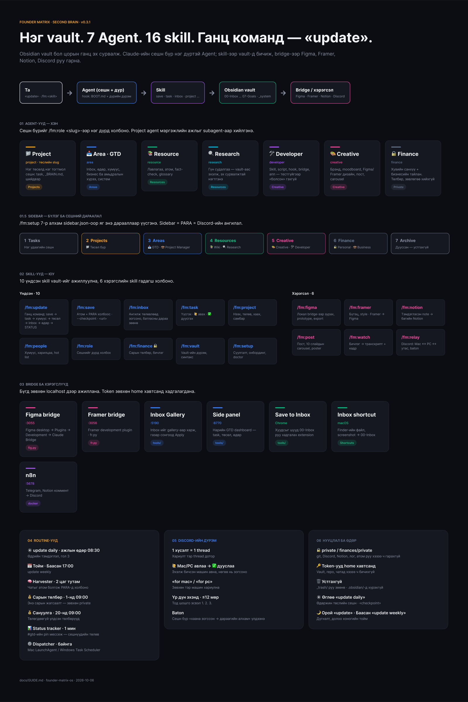

# Founder Matrix — Бүрэн гарын авлага (v0.3.1)

Энэ хуудас fm-ийн **бүх бүрэлдэхүүнийг нэг дор** харуулна: Agent, skill, хэрэгсэл, bridge, routine, Discord. Суулгах алхмыг [README](../README.md#суулгах-шинэ-хэрэглэгч-3060-минут)-ээс, хэрэгсэл бүрийн дэлгэрэнгүйг [docs/tools/](tools/)-оос хар.



> Figma-д `docs/img/system-map.figma.js`-ээр зурагдсан (`fig.py run -f`). Шинэчлэх бол скриптийг засаад дахин ажиллуулж, export хий.

```
         ┌──────────── Та ────────────┐
         │  «update» · /fm:<skill>    │
         └─────────────┬──────────────┘
                       ▼
   Claude сешн = Agent (дүр)  ── hook: BOOT.md + дүрийн дүрэм
     │ skill-ээр ажиллана          │ хэрэгслээр гадагш
     ▼                             ▼
   Obsidian vault (цорын ганц эх)   Figma · Framer · Notion · Discord · бичлэг
```

---

## 1. Agent-ууд (7) — «хэн»

Сешн бүр нэг дүртэй. Дүрээ `/fm:role <slug>`-ээр холбоно. Дүрийн дүрэм vault-ийн `04-Areas/AI Team/ai-workers/`-д.

| Agent | Slug | Хариуцна | Гол skill | Sidebar |
|---|---|---|---|---|
| 📁 **Project** | `project` / төслийн slug | Нэг төсөлд нэг тогтмол сешн: task, `_BRAIN.md`, шийдвэр | project · task · save | Projects |
| 📥 **Area** (GTD) | `area` | Inbox, өдөр, хүмүүс, бизнес/амьдралын хүрээ, систем | update · inbox · task · people · relay | Areas |
| 📚 **Resource** | `resource` | Лавлагаа, атом, fact-check, glossary | save `<url>` · vault | Resources |
| 🔍 **Research** | `research` | Гүн судалгаа → vault-д хадгална | save · watch | Resources |
| 🛠️ **Developer** | `developer` | Код: skill, script, hook, bridge, апп | (superpowers) | Creative |
| 🎨 **Creative** | `creative` | Брэнд, moodboard, Figma/Framer дизайн, пост | post · figma · framer · watch | Creative |
| 🔒 **Finance** | `finance` | Хувийн санхүү + бизнесийн тайлан. Төлбөр, хөрөнгө оруулалтын зөвлөгөө **хийхгүй** | finance | Finance 🔒 |

Project agent мэргэжлийн ажлыг (дизайн, код, судалгаа) Creative/Developer/Research **subagent**-аар хийлгэнэ. Agent бүрийн зураг, дүрэм: **[AGENTS.md](AGENTS.md)**.

## 1.5 Sidebar — бүлэг ба сешний дараалал

`/fm:setup` (7-р алхам) [`plugins/fm/sidebar.json`](../plugins/fm/sidebar.json)-оор яг ингэж үүсгэнэ. Sidebar = PARA = Discord-ийн ангилал.

| # | Бүлэг | Сешн (нээх дараалал) |
|---|---|---|
| 1 | **Projects** | 📁 Portfolio (бүх төслийн төлөв) · 📁 `<Төсөл>` — Active төсөл бүрт нэг |
| 2 | **Areas** | 📥 GTD (setup-ийн сешн өөрөө) · 🏛️ Architect · 🎨 Creative Agent |
| 3 | **Resources** | 📚 Wiki · 🔍 Research · `<сэдэв>` |
| 4 | **Finance** 🔒 | 💼 Business · 🔒 Personal (тусдаа, Discord-гүй) |

Нэг удаагийн сешн бүлэггүй; дууссан сешнийг апп-ын Archive руу (устгахгүй). Энэ бүтэц itge.e-ийн sidebar-тай ижил (2026-10-07); Season 2-ын 12 хичээл үүнийг алхам алхмаар барина.

Нэг дүр = нэг тогтмол сешн. Mac, PC хос сешн ижил гарчигтай (нэг baton, нэг Discord суваг).

## 2. Skill-ууд (16) — «юу»

### Үндсэн 10

| Skill | Нэг өгүүлбэрээр |
|---|---|
| `/fm:update` | **Ганц команд.** save → task → хүмүүс → төсөл → inbox → өдрийн note → STATUS. `daily`, `weekly` горимтой |
| `/fm:save` | Яриаг атом + PARA холбоос болгоно. `--checkpoint` = дундуур барьж авах; `<url>` = лавлагаа + атом |
| `/fm:inbox` | 00-Inbox-ийг ангилж төлөвлөгөө гаргаад **зогсоно**; батласны дараа зөөнө |
| `/fm:task` | Task үүсгэх, 🙋 авах, ✅ дуусгах, жагсаах |
| `/fm:project` | Төсөл нээх, төлөв (Active/Planning/On-hold/Archive), хаах, самбар цэгцлэх |
| `/fm:people` | Хүний note, харилцааны бүртгэл, hot list |
| `/fm:role` | Сешнийг дүрд холбох |
| `/fm:finance` 🔒 | Сарын төлбөр, санхүүгийн бичлэг (зөвхөн Finance сешнд) |
| `/fm:vault` | Vault-ийн дүрэм, frontmatter, синтакс (өөрөө ачаалагдана) |
| `/fm:setup` | Суулгалт, онбординг, `doctor` |

### Хэрэгслийн 6

| Skill | Юу | Заавар |
|---|---|---|
| `/fm:figma` | Figma-д локал bridge-ээр зурах, prototype, export, contrast | [figma.md](tools/figma.md) |
| `/fm:framer` | Framer-ийн бүтэц, style унших, Framer → Figma Variables | [framer.md](tools/framer.md) |
| `/fm:notion` | Тэмдэглэсэн note-ыг багийн Notion руу түлхэх | [notion.md](tools/notion.md) |
| `/fm:post` | Пост, 10 слайдын carousel, poster — brief-ээс шалгасан зураг хүртэл | [post.md](tools/post.md) |
| `/fm:watch` | Бичлэг → транскрипт + кадрын хуудас + мета | [watch.md](tools/watch.md) |
| `/fm:relay` | Discord: Mac ↔ PC ↔ утас, baton, dispatcher | [relay.md](tools/relay.md) |

## 3. Bridge-үүд — Claude ↔ дизайны апп

| Bridge | Порт | Асаах | Апп талд |
|---|---|---|---|
| **Figma** | `127.0.0.1:3055` | «figma bridge асаа» (`node plugins/fm/tools/figma/bridge/server.mjs`) | Figma desktop → Plugins → Development → **Claude Bridge** |
| **Framer** | `127.0.0.1:3056` | «framer bridge асаа» | Framer → development plugin |

Шалгах: `fig.py status` → `'plugin': True`. Хоёул зөвхөн localhost, token хэрэггүй (Figma REST-д л `~/.figma_token`).

## 4. Нэмэлт хэрэгслүүд (`tools/`)

| Хэрэгсэл | Юу | Ажиллуулах |
|---|---|---|
| **Inbox Gallery** | 00-Inbox-ийг gallery-аар харж, очих газрыг сонгоод Apply | `python3 tools/inbox-gallery/server.py` → localhost:5190 |
| **Side panel** | Нарийн GTD dashboard (task, төсөл, өдөр) | `python3 tools/sidepanel/server.py` → localhost:8770 |
| **Save to Inbox** | Chrome extension: хуудсыг vault-ийн inbox руу | `tools/save-to-inbox/README.txt` |
| **move-to-inbox.sh** | Finder-ийн файл → inbox (Shortcuts-аар товчлол) | Shortcuts → Run Shell Script |
| **screenshot-to-inbox.sh** | Дэлгэцийн зураг → inbox + «юу хийлгэх вэ» | Shortcuts → Run Shell Script |
| **n8n** | Telegram, Notion коммент → Discord | `tools/n8n/README.md` (docker) |

## 5. Routine-ууд — өөрөө ажилладаг

`/fm:setup` (8-р алхам) [`plugins/fm/routines/`](../plugins/fm/routines/)-ийн загвараас асууж үүсгэнэ. Sidebar → **Routines**-оос харж, унтрааж болно. **Vault руу бичдэг routine зөвхөн нэг (гол) машин дээр**, Harvester машин бүрт — 2 дахь компьютер дээр 5 routine биш, ганц Harvester байх нь зөв.

| Routine | Хэзээ | Юу |
|---|---|---|
| ☀️ **Өглөөний update daily** | Ажлын өдөр 08:30 | Өдрийн тэмдэглэл, гол 3, нээлттэй task |
| 📅 **Долоо хоногийн тойм** | Баасан 17:00 | `update weekly` |
| 🧠 **Harvester** | 2 цаг тутам | Сешнүүдийн чатыг атом болгож PARA-д холбоно — Discord **хэрэггүй** (🔒 хувийн сешнийг алгасна) |
| 💰 **Сарын төлбөр** | Сар бүрийн 1-нд 09:00 | Энэ сарын төлөх жагсаалт (зөвхөн private хавтсанд) |
| 💰 **Төлөгдөөгүй сануулга** | Сар бүрийн 20-нд 09:00 | Үлдсэн төлбөрүүд (зөвхөн private хавтсанд) |
| 📊 **Status tracker** | 1 минут тутам (dispatcher) | Discord #gtd-ийн pin мессежид сешнүүдийн төлөв |

Байнгын процесс: Discord **dispatcher** — Mac LaunchAgent `com.fmos.dispatcher` / Windows Task Scheduler ([relay.md](tools/relay.md)).

## 6. Discord — хаана юу ярих вэ

| Ангилал (= sidebar бүлэг) | Суваг |
|---|---|
| Areas | `#gtd` (бүгдийг сонсоно), `#architect`, … |
| Projects | төсөл бүрт нэг суваг (Mac + PC хос сешн хуваалцана) |
| Resources · Research · Creative · Development | дүр бүрт нэг суваг |
| Finance | **суваггүй** 🔒 |

**Дүрэм:**
1. Нэг хүсэлт = нэг **thread**. Хариулт тэр thread дотор.
2. Ажлыг авсан машин эхлээд **«🙋 Mac/PC авлаа»** гэж бичнэ — нөгөө машин зогсоно. Дуусахад **«✅ дууслаа: …»**.
3. «for mac» / «for pc» гэвэл зөвхөн тэр машин.
4. Бичих хэв: эхэнд нэг өгүүлбэрээр үр дүн, дараа нь тод шошго эсвэл 1. 2. 3., ≤12 мөр.
5. Сешн дуусах бүрд **baton** («хаана зогссон → дараагийн алхам») автоматаар хадгалагдана.

## 7. Нууцлал — 3 хатуу дүрэм

0. **Vault → Google Drive, код → локал диск.** Vault Google Drive дотор (`My Drive/Second Brain`, Mirror files) — нөөц ба Mac ↔ PC sync. Vault-ийг бүхэлд нь бусадтай share хийхгүй (хувийн хавтас хамт явна). Repo-гийн clone Drive-д **биш**, локал дискэнд (`.git` эвдэрнэ).

1. `private: true` эсвэл `finances/private/` — git, Discord, Notion, STATUS, лог, атом руу **хэзээ ч** гарахгүй.
2. Token-ууд зөвхөн home хавтсанд (`~/.fmos_discord_token`, `~/.figma_token`, `~/.fmos/notion_token`). Vault, repo, чатад биш.
3. fm `.obsidian/`-д хүрэхгүй; юу ч устгахгүй (`_trash/` руу зөөнө).

## 8. Өдөр тутмын хэрэглээ — 3 алхам

1. Өглөө: Area сешнд **«update daily»**.
2. Өдөржин: төслийн сешндээ ажилла; барьж авах бол **«checkpoint»**.
3. Орой: **«update»** → дараа нь **«update daily»** (дүгнэлт). Баасан: **«update weekly»**.
